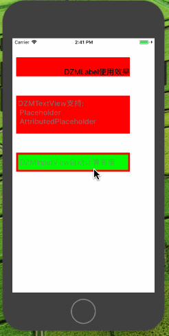
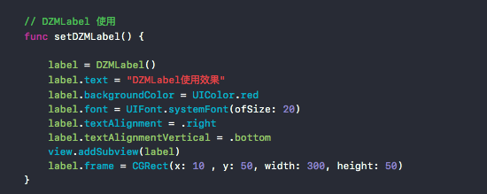
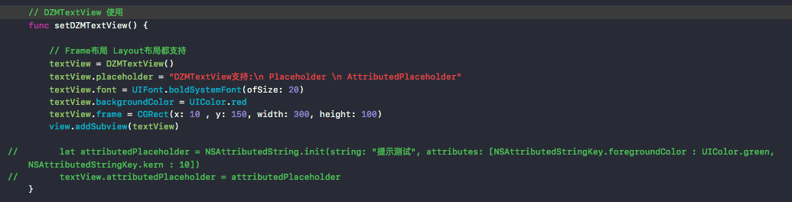
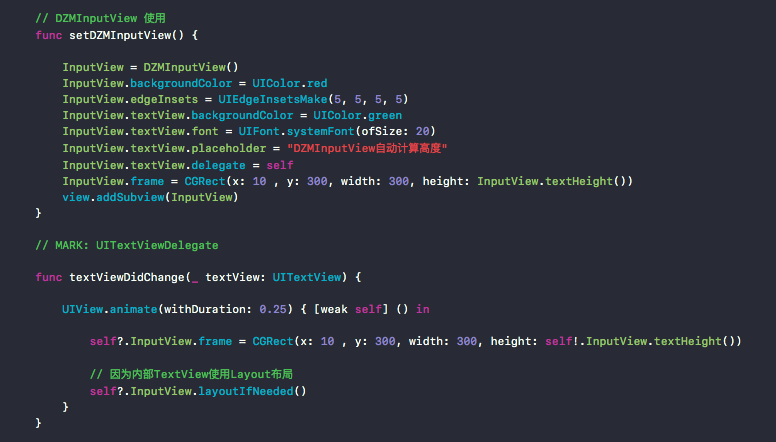

# DZMTextView

***
#### Demo效果：

***
#### 简介:

    DZMLabel: 支持 - 垂直上中下摆放
    
    DZMTextView: 支持 - Placeholder和AttributedPlaceholder
    
    DZMInputView: 支持 - 简单使用计算高度适合用于做聊天输入框
    
***
#### 代码:

